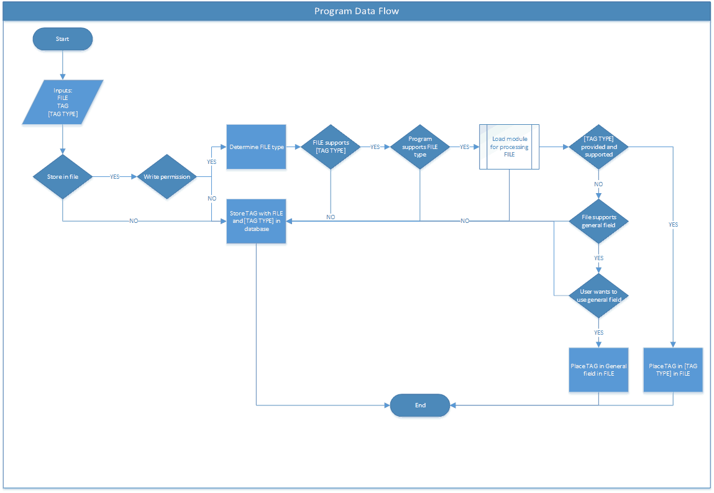

# File Tagger: Tag-Based File Manger

This program serves to organize files based on a tagging system. While an OS-based system may provide many benefits, the Rust-written, standalone file tagging program permits a user to operate across systems.

When possible, the tagger embeds metadata directly in an applicable field of a file. If not, an associated document database provides the storage medium for the information.

# Overview

## Program Flow

## Layout  

Source code resides in the *src* directory. Within *src*, *modules* contains code related to specific file types.
These file modules must implement the provided interface so as to ensure program operation.
Documentation sources can be found under *doc*.

# License

All aspects of this program, unless otherwise noted, fall under the [GNU LGPLv3 License](LICENSE.md).
